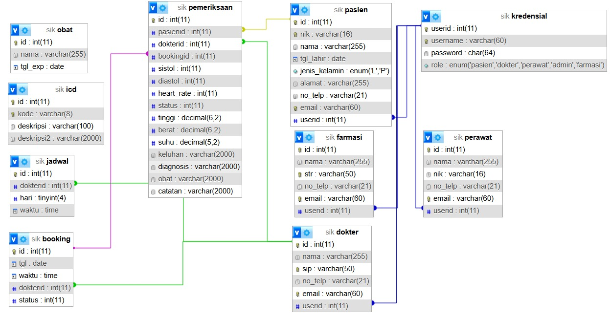

# Tugas Besar Sistem Informasi Kesehatan EB4007-2024
# Sistem 
## Tujuan
Integrasi layanan kesehatan di Puskesmas
## Fungsi utama
- Manajemen konsultasi dokter (pendaftaran, pengisian rekam medis)
- Manajamen farmasi (pengelolaan data obat-obatan)
## *Use case* sistem
- Pendaftaran konsultasi dokter oleh pasien
- Melihat riwayat pemeriksaan pasien
- Pengisian data tanda vital
- Pengisian hasil pemeriksaan
- Manajemen farmasi dan resep obat
## Skema elemen data

## Kontributor
- 18321005 Wida Inaya Sekar Helia
- 18321014 Maulida Adhifa Naila Muthi
- 18221163 Aufar Ramadhan
